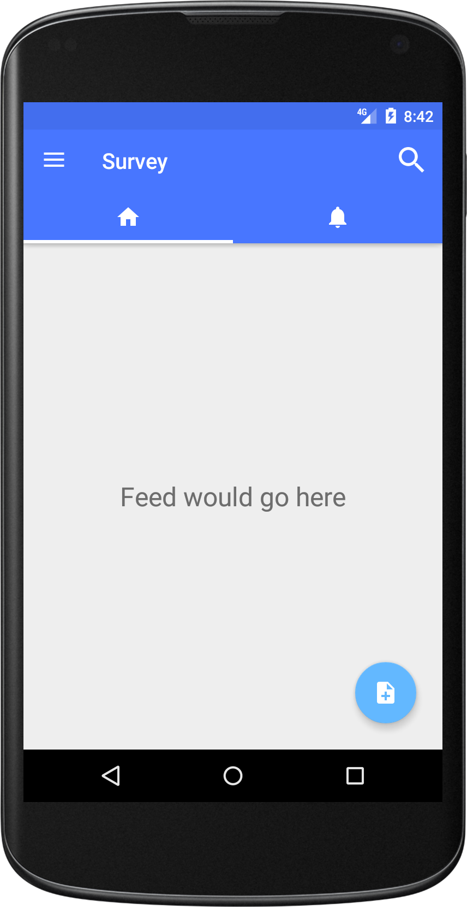
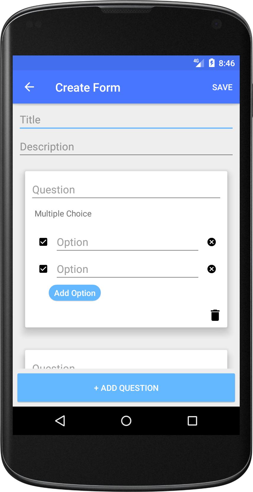
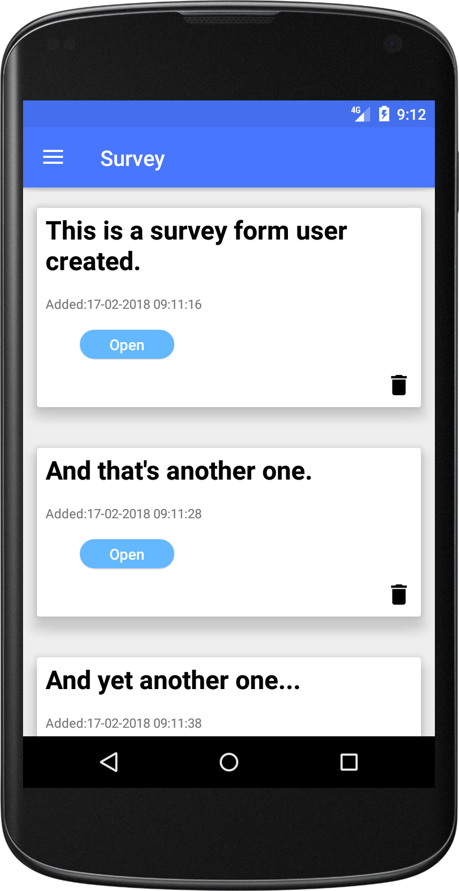

# Survey  #

This is an app that allows user to create and publish surveys, vote and check the results. 

As for now it is basically an MVVM architecture pattern practice project, utilizing Android Architecture Components.

### That's what some of it looks like ###

Home screen                     | Create Form screen                 | Browse forms screen
:------------------------------:|:----------------------------------:|:--------------------------------:
 |  | 

### Contributions ###
This is definitely under construction. A couple of functionalities are yet to be implemented.
However, pull requests and comments about currently available code are most welcome.
